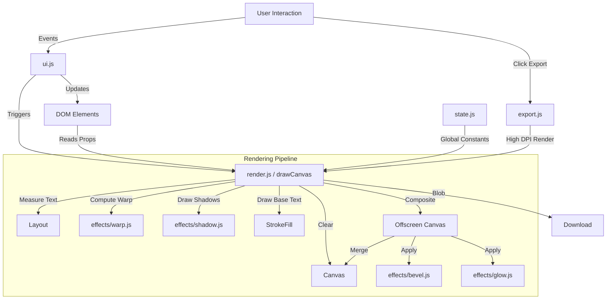

# Architecture & Data Flow

This document describes the high-level architecture of the Text Effect Demo.

## Overview

The application follows a standard **Immediate Mode** rendering pattern.
1.  **State**: The configuration is primarily stored in the DOM elements (inputs) for persistence across reloads (browser cache) and immediate feedback. Some transient state is stored in `state.js`.
2.  **Input**: User changes inputs (color, text, sliders).
3.  **Update**: Event listeners in `ui.js` detect changes.
4.  **Render**: `render.js` reads the current DOM values, computes the scene, and draws to the `<canvas>`.

## Data Flow Diagram

## Key Modules

### 1. `main.js` (Bootstrap)
- Initializes the application.
- Loads fonts.
- Sets up the render loop (`setInterval` for auto-updates).

### 2. `ui.js` (Controller)
- Manages all event listeners.
- Handles UI logic like Font Dropdown toggling, Style button states.
- Updates the gradient editor UI.

### 3. `render.js` (View/Engine)
- The core engine.
- `drawCanvas()`: Wrapper for the main render.
- `renderScene(canvas, ctx, scale)`:
    - Independent of the DOM element `myCanvas` (can render to offscreen canvas for export).
    - Reads values from DOM.
    - Orchestrates the drawing order: Background -> Shadows -> Text -> Bevel/Glow.

### 4. `export.js` (Output)
- Handles `toBlob` or `toDataURL` conversion.
- Manages DPI scaling (rendering at 2x or 3x resolution).

### 5. `effects/` (Logic)
- Pure rendering logic for specific effects.
- Most effects take a context (`ctx`) and apply pixel manipulation or path drawing.
